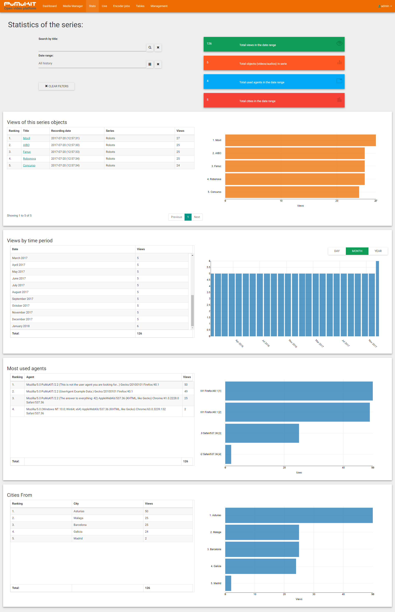

PuMuKIT Paella Stats UI
================

Bundle based on [Symfony](http://symfony.com/) to work with the [PuMuKIT Video Platform](https://github.com/campusdomar/PuMuKIT2/blob/2.1.x/README.md).




Installation
------------

Steps 1 and 2 requires you to have Composer installed globally, as explained in the [installation chapter](https://getcomposer.org/doc/00-intro.md) of the Composer documentation.


### Step 1: Download the Bundle

Open a command console, enter your project directory and execute the
following command to download the latest stable version of this bundle:

```bash
$ composer require teltek/pmk2-paella-stats-ui-bundle dev-master
```


### Step 2: Uninstall the default UI Stats Bundle

The StatsUIBundle needs to be uninstalled in order for the Paella Player Stats UI to work properly:

Uninstall the bundle by executing the following line command. This command updates the Kernel to remove the bundle (app/AppKernel.php) and unloads the boundle routes from (app/config/routing.yml).

```bash
$ php app/console pumukit:install:bundle --uninstall Pumukit/StatsUIBundle/PumukitStatsUIBundle
```


### Step 3: Install the Bundle

Install the bundle by executing the following line command. This command updates the Kernel to enable the bundle (app/AppKernel.php) and loads the routing (app/config/routing.yml) to add the bundle routes\
.

```bash
$ php app/console pumukit:install:bundle Pumukit/PaellaStatsUIBundle/PumukitStatsUIBundle
```


### Step 4: Update assets

```bash
$ php app/console cache:clear
$ php app/console cache:clear --env=prod
$ php app/console assets:install
```
